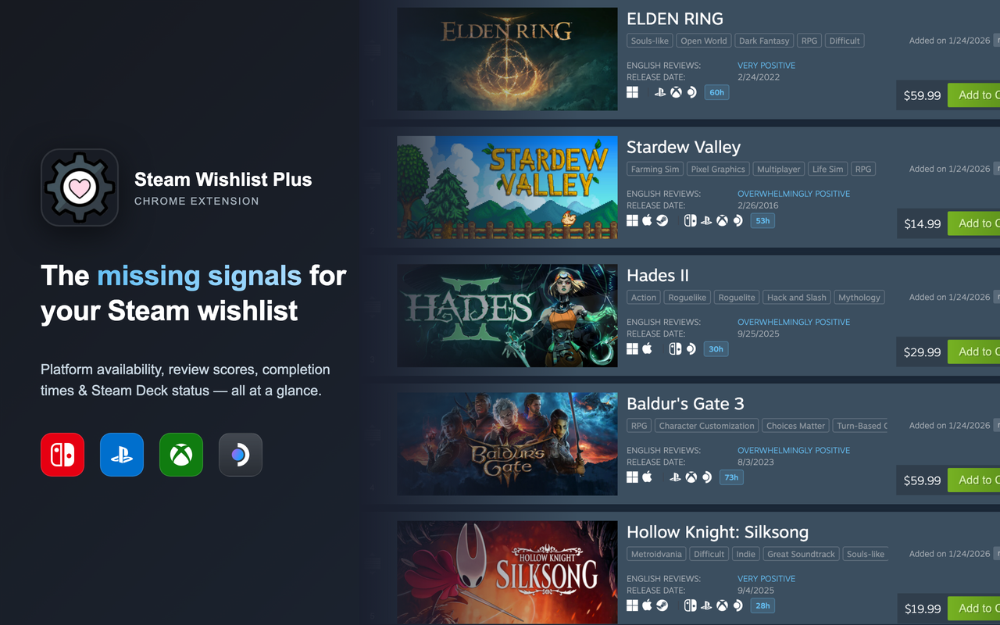

# Steam Wishlist Plus

[](LICENSE)
[](https://github.com/keyunjie96/steam-wishlist-plus/releases)
[]()

Adds the missing signals to your Steam wishlist — platform availability, review scores, completion times, and Steam Deck status.



## Why?

Steam's wishlist lacks context for buying decisions. Platform availability, review scores, and completion times are all scattered across different sites. This extension brings them together, right on your wishlist page.

No price history, no tracking, no telemetry. ~70KB, runs entirely client-side.

**Philosophy:** Every signal that helps you decide what to buy next, right on your wishlist page. No accounts, no cloud sync, no telemetry.

## Install

```bash
npm i && npm run build
```

Then `chrome://extensions` → Developer mode → Load unpacked → select this folder.

No backend. Everything runs client-side with a 7-day cache.

**Requirements:** Chrome 88+ (MV3). Firefox/Edge not supported yet.

## Features

- **Review scores** — OpenCritic ratings displayed inline
- **Platform availability** — Nintendo Switch, PlayStation, Xbox, Steam Deck status at a glance
- **Completion times** — HowLongToBeat data inline (when their API cooperates)
- **Direct store links** — Click any icon to jump to that platform's store page
- **No backend** — Runs entirely client-side with 7-day cache
- **No telemetry** — Wikidata queries only, nothing phoned home

## How it works

| Source | What | Catch |
|--------|------|-------|
| Wikidata SPARQL | Platform availability | Incomplete coverage (volunteer-maintained) |
| OpenCritic | Review scores | Requires Wikidata ID mapping |
| HLTB API | Completion times | Undocumented, breaks monthly |
| Steam SSR | Deck verified status | Requires page script injection¹ |

¹ MV3 content scripts can't access page JS context, so we inject `steamDeckPageScript.ts` to read Steam's SSR data.

When HLTB breaks, times disappear but platform icons still work.

**Why Wikidata?** Free, no API key, anyone can fix bad data. Coverage gaps are a data problem, not a code problem.

## Architecture

```
┌─────────────┐  message   ┌─────────────┐
│   content   │ ─────────► │  background │
│   script    │ ◄───────── │   worker    │
└──────┬──────┘  response  └──────┬──────┘
       │                          │
       ▼                          ▼
  DOM injection            ┌──────┴──────┐
  + page script            │   resolver  │
  (SSR data)               └──────┬──────┘
                                  │
                    ┌─────────────┼──────────────┐
                    ▼             ▼              ▼
                 cache       wikidata     review scores
```

See [CLAUDE.md](CLAUDE.md) for full architecture details and dev workflow.

## Limitations

- **Wikidata**: Many games missing platform data. You can [add them](https://www.wikidata.org/wiki/Wikidata:WikiProject_Video_games) yourself.
- **HLTB**: Fuzzy name matching misses some titles (especially indies). No official API.
- **Rate limits**: 500ms delay between Wikidata queries to avoid throttling.

## Troubleshooting

- **Icons not showing?** Check DevTools console for `[SWP` messages
- **Times missing?** HLTB API probably changed again. Check network tab on howlongtobeat.com
- **Wrong platform data?** Wikidata issue — anyone can fix it at [wikidata.org](https://www.wikidata.org/)

## Development

```bash
npm run build          # TypeScript → dist/
npm run test:unit      # Jest + coverage
npm run test:integration  # Full E2E (slow)
```

## Contributing

PRs welcome. See [CLAUDE.md](CLAUDE.md) for architecture and dev workflow.

## Acknowledgments

- [Wikidata community](https://www.wikidata.org/wiki/Wikidata:WikiProject_Video_games) for maintaining game platform data
- [HowLongToBeat](https://howlongtobeat.com/) for completion times (undocumented API, but it works)
- [OpenCritic](https://opencritic.com/) for review score aggregation
- Valve for SSR data we read via page script injection

## License

Apache 2.0
